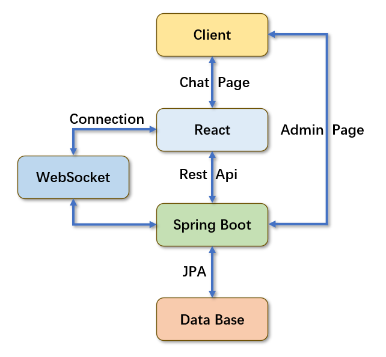
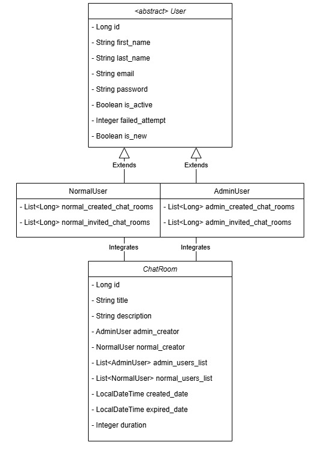
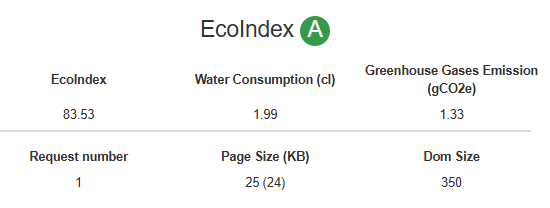
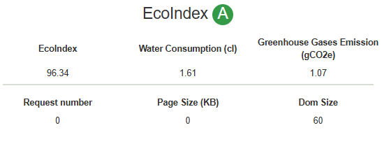

## Structure of the project

This application structure is created based on SpringMVC. 

For the Chat part, React is the View, and for the Admin part, html in SpringBoot is the view.

Spring is the controller and connect to the database of the models.

## UML

In this application, there are two types of user, admin user and normal user. 
Both of the user can create and can be invited into a chatroom. 
The only difference between them is that admin users are authorized to enter the admin page via springboot to manage all accounts.

## Interaction
1. React is good at handling dynamic web pages. 
So it is used to create the chat user interface.
It will connect to WebSocket based on the ID when users try to enter the room and update the message to the chat area immediately after receiving the message.
2. SpringBoot works as the background of the application. For admin part, the controllers handle the instruction of admin users and return the view. 
For chat part, it offers rest api to provide information and update to database.
3. WebSockets enable bidirectional realtime communication between the client and the server, which allows the server to send real-time updates to the client without reloading or reconnecting.

## GreenIT results
A simple optimization can save surprising resources, that's the reason why greenIT should be applied.
To improve further, reused resources should be stored to prevent multiple requests, good programming and design patterns should be adopted to optimize code efficiency and reduce resource consumption and design simple and efficient interfaces.
### Admin user list page

### Chat page

## Web Security
These designs are bonus for the security part
1. 3 times' failure of entering the password will dis-activate the account, an admin user should activate before retrying.
2. BCrypt is adopted for password before storing into the database, no real-password will be stored.
3. CAPTCHA is used when sign up and forget password in order to prevent malicious attacks.

## What's more
While history messages are also essential for a chat application, we have created a message class to store the messages in order to show them after connecting.
However, due to the complexity and the time, we didn't implement this part. This is a good next step to finish a complete chat application.
